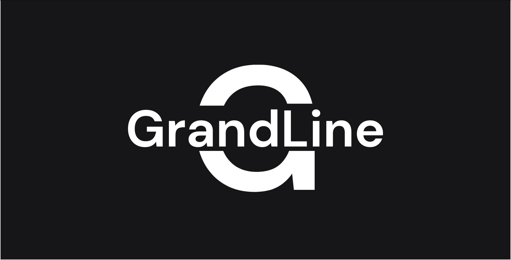

# Welcome to the GrandLineX Documentation

> GrandLineX is an out-of-the-box server framework.
> Goto [concepts](/docs/concepts/) for details.

### Short Links

- [Kernel Packages](/docs/kernel-packages/)
- [Bundles](/docs/bundles/)
- [Project-Tool](/docs/utils/#project-tool)
- [Docs to OpenApi](/docs/utils/#docs-to-openapi-v3) 
